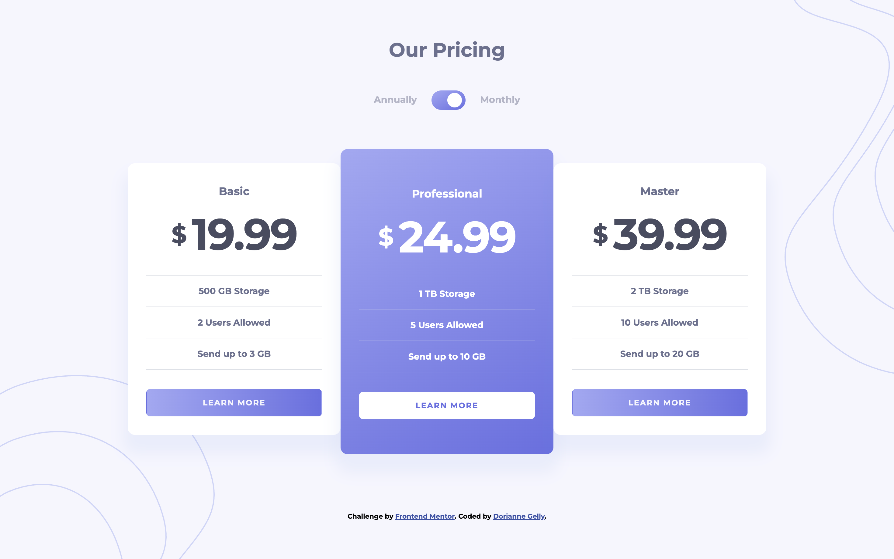

# Frontend Mentor - Solution Pricing component with toggle

Ceci est une solution au [défi Pricing component with toggle](https://www.frontendmentor.io/challenges/pricing-component-with-toggle-8vPwRMIC). Les défis de Frontend Mentor vous aident à améliorer vos compétences en codage en construisant des projets réalistes.

## Table des matières

- [Aperçu](#aperçu)
  - [Le défi](#le-défi)
  - [Capture d'écran](#capture-décran)
  - [Liens](#liens)
- [Mon processus](#mon-processus)
  - [Construit avec](#construit-avec)
  - [Ce que j'ai appris](#ce-que-jai-appris)
  - [Développement continu](#développement-continu)
  - [Ressources utiles](#ressources-utiles)
- [Auteur](#auteur)
- [Remerciements](#remerciements)

**Note : Supprimez cette note et mettez à jour la table des matières en fonction des sections que vous conservez.**

## Aperçu

### Le défi

Les utilisateurs doivent pouvoir :

- Voir la disposition optimale du composant en fonction de la taille de l'écran de leur appareil.
- Contrôler la bascule avec leur souris/pavé tactile et leur clavier.
- **Bonus** : Réaliser le défi uniquement avec HTML et CSS.

### Capture d'écran



### Liens

- URL de la solution : [Ajoutez l'URL de votre solution ici](https://your-solution-url.com)
- URL du site en ligne : [Ajoutez l'URL de votre site en ligne ici](https://your-live-site-url.com)

## Mon processus

### Construit avec

- Balises HTML5 sémantiques
- Propriétés personnalisées CSS
- Flexbox
- Grille CSS
- Flux de travail mobile-first
- [React](https://reactjs.org/) - Bibliothèque JS
- [Next.js](https://nextjs.org/) - Framework React
- [Styled Components](https://styled-components.com/) - Pour les styles

**Note : Ce sont juste des exemples. Supprimez cette note et remplacez la liste ci-dessus par vos propres choix.**

### Ce que j'ai appris

Utilisez cette section pour récapituler certaines de vos principales leçons apprises en travaillant sur ce projet. Les écrire et fournir des exemples de code des zones que vous souhaitez mettre en avant est un excellent moyen de renforcer vos connaissances.

Pour voir comment ajouter des extraits de code, voir ci-dessous :

```html
<h1>Un code HTML dont je suis fier</h1>